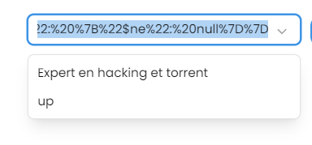

# AirMentorBug

## Description

AirMentor est une application éducative qui permet aux utilisateurs de créer des cours et d'interagir avec des mentors ou professeurs en temps réel. Pour démontrer l'importance de la sécurité applicative, nous avons volontairement intégré des failles de sécurité dans cette version spéciale nommée AirMentorBug. Ces failles sont analysées et corrigées pour servir d'exemple éducatif sur les bonnes pratiques de sécurité dans le développement des applications web.

L'objectif est de montrer aux développeurs comment identifier, exploiter, et corriger des vulnérabilités critiques, particulièrement dans la logique d'autorisation, afin de rendre les applications plus robustes.

## Setup and Installation

1. Clone the repository
2. docker-compose up

## Failles

### 1. Logique d'Autorisation Permissive (Authorization Bypass)

#### Description

- Une **faille de logique d'autorisation** survient lorsque le mécanisme de contrôle d'accès est mal implémenté, permettant à des utilisateurs non autorisés d'accéder à des ressources ou d'exécuter des actions normalement interdites.
- Dans ce cas précis, la condition permissive permet à un utilisateur d'accéder à une ressource dès qu'il a un rôle quelconque, même si ce rôle n'est pas autorisé pour la ressource ou l'action demandée.

### **Description** :

- Une **faille de logique d'autorisation** survient lorsque le mécanisme de contrôle d'accès est mal implémenté, permettant à des utilisateurs non autorisés d'accéder à des ressources ou d'exécuter des actions normalement interdites.
- Dans ce cas précis, la condition permissive permet à un utilisateur d'accéder à une ressource dès qu'il a un rôle quelconque, même si ce rôle n'est pas autorisé pour la ressource ou l'action demandée.

### **Exploitation** :

- Un attaquant peut manipuler un token JWT pour inclure un rôle minimal valide (ex. : "USER").
- La logique permissive permet d'accéder à des fonctionnalités ou des ressources destinées à des rôles supérieurs (ex. : "ADMIN").
- Par exemple :Résultat : L'accès est autorisé à l'utilisateur ayant le rôle "USER".

```jsx
GET / api / admin / dashboard;
Authorization: Bearer[token_with_role_user];
```

Faille :

```jsx
const matchingRule = rules.find(
  (rule) => path.startsWith(rule.path) && rule.methods.includes(method) && rule.roles.includes(role)
);

// Faille : Permet l'accès si aucune règle stricte ne correspond mais que l'utilisateur a au moins un rôle
if (!matchingRule) {
  console.log("! No strict matching rule found, allowing access based on role fallback.");
  if (role) { // Permissivité : n'importe quel rôle permet d'accéder
    return next();
  }
}

```

### **Impact** :

- Accès non autorisé à des données sensibles.
- Possibilité d'exécuter des actions réservées aux administrateurs ou autres rôles privilégiés.

### **Prévention et correction** :

1. **Renforcer la logique de contrôle des rôles** :
   - Rejeter toutes les requêtes où le rôle ne correspond pas explicitement à une règle définie.
2. **Auditer les règles d'autorisation** :
   - S'assurer que chaque chemin et méthode a des règles clairement définies.
3. **Tests de sécurité** :
   - Effectuer des tests manuels et automatisés pour détecter des failles dans la logique d'autorisation.
4. **Logs détaillés** :
   - Ajouter des logs indiquant pourquoi une requête est bloquée ou autorisée pour faciliter le diagnostic des problèmes d'autorisation.

Cette faille est souvent classifiée comme une **vulnérabilité critique**, car elle peut compromettre des données ou des fonctionnalités sensibles dans une application.

**Solution :**

```jsx
const matchingRule = rules.find(
  (rule) =>
    path.startsWith(rule.path) &&
    rule.methods.includes(method) &&
    rule.roles.includes(role)
);

// Bloquer l'accès si aucune règle ne correspond exactement
if (!matchingRule) {
  console.log("! No matching rule found, denying access.");
  return context.json({ message: "Forbidden" }, 403);
}
```

### 2. Injection JSON (JSON Injection)

Le code original contient une **faille de manipulation de filtre MongoDB**, permettant à un attaquant de soumettre des objets JSON arbitraires dans le paramètre `q`. Cette logique peut être exploitée pour contourner les restrictions de recherche ou injecter des filtres non autorisés dans les requêtes MongoDB.

## **Origine de la Faille**

1. **Validation insuffisante du paramètre `q`** :

   - Le code tente de vérifier si `q` est un JSON valide via `JSON.parse(decodeURIComponent(searchQuery))`.
   - Si c'est le cas, il utilise directement l'objet JSON comme filtre MongoDB sans contrôle strict, exposant la base de données à des requêtes non prévues.

2. **Absence de contrôle strict sur les clés du filtre** :

   - Les clés de l'objet JSON (comme `title`, `$ne`) sont utilisées sans vérification, permettant des requêtes malveillantes telles que :
     ```json
     {
       "is_activate": false,
       "title": { "$ne": null }
     }
     ```
     Ces requêtes peuvent contourner les règles métier et afficher des données sensibles.

   #### Code defectueux

   ```jsx
   // Search announcements by title
   announcements.get("/search/:q", async (c) => {
     const searchQuery = c.req.param("q");

     if (!searchQuery) {
       return c.json({ msg: "Query parameter is missing" }, 400);
     }

     try {
       let filter;

       // Vérifiez si le paramètre est une chaîne JSON valide
       try {
         const parsedQuery = JSON.parse(decodeURIComponent(searchQuery));
         if (typeof parsedQuery === "object" && parsedQuery !== null) {
           // Si c'est un objet JSON, utilisez-le comme filtre
           filter = parsedQuery;
         } else {
           throw new Error("Invalid JSON");
         }
       } catch {
         // Si ce n'est pas un JSON, appliquez la recherche par regex par défaut
         filter = {
           title: { $regex: searchQuery, $options: "i" },
           is_activate: true,
         };
       }

       // Effectuez la recherche dans MongoDB
       const announcements = await Announcement.find(filter, {
         title: 1, // Inclure uniquement le titre
         _id: 1, // Inclure uniquement l'identifiant
       });

       // Formatez les résultats
       const formattedResults = announcements.map((announcement) => ({
         title: announcement.title,
         id: announcement._id,
       }));

       return c.json(formattedResults);
     } catch (error) {
       console.error("Error searching announcements:", error);
       return c.json({ message: "Internal server error" }, 500);
     }
   });
   ```

## **Exploitation Possible**

Un attaquant peut injecter un filtre JSON malveillant dans le paramètre `q`. Exemple :

```http
?q=%7B%22is_activate%22%3A%20false%2C%20%22title%22%3A%20%7B%22%24ne%22%3A%20null%7D%7D
```

Une fois décodé, cela donne :

```json
{
  "is_activate": false,
  "title": { "$ne": null }
}
```

Cette requête peut permettre à l'attaquant d'accéder à des annonces désactivées, ce qui viole les règles métier.

## Impact

- **Exposition de données sensibles** : Les annonces désactivées ou non publiées peuvent être affichées.
- **Contournement des restrictions** : Les règles de recherche sont ignorées, donnant accès à des données protégées.
  

---

## Solution Apportée

### Modifications dans le Code Corrigé

1. **Suppression de la logique JSON conditionnelle** :

   - Le filtre JSON est remplacé par une recherche stricte et immuable :
     ```javascript
     {
       title: { $regex: searchQuery, $options: "i" },
       is_activate: true,
     }
     ```
   - Cela empêche toute injection JSON et manipulation non autorisée.

   #### Code Corrigé:

   ```jsx
   announcements.get("/search/:q", async (c) => {
     const searchQuery = c.req.param("q");
     if (!searchQuery) {
       return c.json({ msg: "Query parameter is missing" }, 400);
     }

     try {
       const announcements = await Announcement.find(
         {
           title: { $regex: searchQuery, $options: "i" },
           is_activate: true,
         },
         {
           title: 1, // Include title
           _id: 1, // Include _id
         }
       );

       const formattedResults = announcements.map((announcement) => ({
         title: announcement.title,
         id: announcement._id,
       }));

       return c.json(formattedResults);
     } catch (error) {
       console.error("Error searching announcements:", error);
       return c.json({ message: "Internal server error" }, 500);
     }
   });
   ```

2. **Validation stricte des paramètres** :

   - La recherche est limitée à des critères fixes (`title` et `is_activate`) définis dans le filtre MongoDB.

3. **Conformité avec les règles métier** :
   - Seules les annonces actives (`is_activate: true`) correspondant au terme recherché sont retournées.

### 3.  Faille XSS

# Description:
Une faille XSS (Cross-Site Scripting) se produit lorsqu'un site web permet à un utilisateur malveillant d'insérer du code JavaScript (ou d'autres scripts) dans une page web qui sera ensuite exécuté par d'autres utilisateurs.

# Exploitation: 

Saisir dans un champ de formulaire du code malveillant tel que :

```jsx
<script>alert('XSS Attack!');</script>
ou

```
 Rendu de la faille :

On voit que l'image est rendu alors qu'on devrait avoir un texte.

Faille : 

```jsx
announcements.post("/", async (c) => {
  const body = await c.req.json();

  try {
    // Vulnérabilité : accepter les données telles quelles, sans validation ni nettoyage
    const newAnnouncement = new Announcement(body);
    const saveAnnouncement = await newAnnouncement.save();

    // Vulnérabilité : inclure les données directement dans la réponse, sans échappement
    return c.html(
      <div>
        <h1>Announcement Created</h1>
        <p>Title: ${saveAnnouncement.title}</p>
        <p>Description: ${saveAnnouncement.description}</p>
        <p>Created By: ${saveAnnouncement.createdBy}</p>
      </div>
    );
  } catch (error: unknown) {
    return c.json(
      {
        message: "Error creating announcement",
        // @ts-ignore
        details: error._message,
      },
      400
    );
  }
});
```
# Solution: 

```jsx
announcements.post("/", async (c) => {
  const body = await c.req.json();

  try {
    // Vulnérabilité : Acceptation des données utilisateur sans validation ni échappement
    const newAnnouncement = new Announcement(body);
    const saveAnnouncement = await newAnnouncement.save();

    // Retourne les données créées directement, y compris le script malveillant
    return c.json(saveAnnouncement, 201);
  } catch (error: unknown) {
    return c.json(
      {
        message: "Error creating announcement",
        // @ts-ignore
        details: error._message,
      },
      400
    );
  }
});
```
